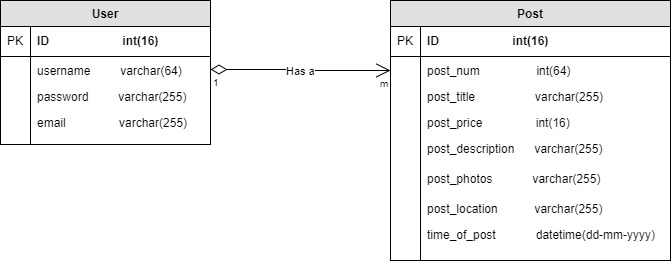

Detailed Database Design document
===

### __2.1__
* Description
    * Our project is an art gallery web application. Users are able to post their art, like other art posts, and purchase other pieces of art. We plan to build a graph database because of the relationships on the website. There will be a user and post entity. But everything else can be represented by a relationship between users and posts. For example, a user can like a post. Infact, a user can like any number of posts. A graphical database represents these relationships the way we need. We know the Neo4j database engine will serve as the best option for our project.
* Database Engine
    * We are going to use Neo4J as our native graphical database engine.
* Potential Users
    * The users will be the DBAs and the artists who created an account on the site.

### __2.2__
* Data Dictionary
    * [User] (Represents every user registered on the web application)
        * [id] (Serves as the primary key for all user entities)
        * [username] (Visual name that other users see on the platform)
        * [password] (Stored as a hashed password for security purposes)
        * [email] (Optional, used for users to get in touch with other users outside of the platform)
    * [Post]
        * [id] (Serves as the primary key for all post entities)
        * [post_num] (Serves as the candidate key for all post entities)
        * [post_title] (title of the post seen by users)
        * [post_price] (price of the item in the post seen by all users)
        * [post_description] (short desciption of the item in the post seen by all users)
        * [post_photos] (small photo album showcasing item in post to all users)
        * [post_location] (where the item in the post is held on earth)
        * [time_of_post] (when the post was created)
### __2.3__

