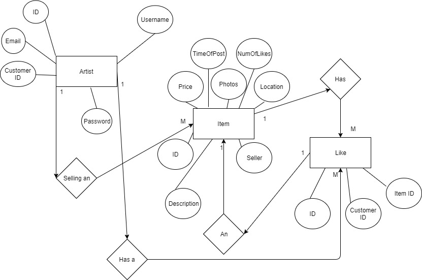

[# __LeGorric-Hitchcock-401-Database__

## 1.1 – Project description, database engine used, potential users, maybe some other stuff
* Description
    * We plan to build a graph database to represent connected data for an art gallery web application where artists can post and purchase art pieces directly from other artists.
* Engine
    * We are going to use Neo4J as our native graphical database engine.
* Users
    * The users will be the DBAs and the artists who created an account on the site.

## 1.2 – Data description, generally what type of data will be stored
* We will store users, user rating, number of art pieces sold, uploaded art, liked art, previously purchased art, previously sold art, art information such as prices, photos, description, time of posting, and number of likes on post.

## 1.3 – At least five examples of the type of data your database will provide to the user
* A list of the posts each user has.
* Security to not have users plaintext passwords displayed.
* Ability to insert new user manually into table.
* Create a post for a user manually.
* Average Price of items on table (marketing purposes).

## 1.4 – A preliminary idea of the schema of the database including table descriptions and potential columns
* __Table__
    * Artist
        * Description
            * This Table will keep track of all the customers/users information, where it be profile, login info, bio information, purchasing history, etc
        * Columns
            * ID (primary key)
            * Username
            * Password (hash)
            * Email (optional)
            * Customer ID Number (ID)
    * Item
        * Description
            * This table will keep track of the for sale items in the database, listing all the important information so it can be sold
        * Columns
            * ID
            * Item Number
            * Item Name
            * Item Seller (FK)
            * Item Price
            * Item Description
            * Item Photos
            * Item Location
            * Item NumberOfLikes
            * Item timeofpost
    * Like
        * Description
            * A table that represents all of the likes
        * Columns
            * ID
            * Customer ID (FK)
            * Item ID (FK)

## 1.5 – A complete preliminary Entity-Relationship Diagram [ERD] for the database [NOT hand-drawn, PLEASE!]

